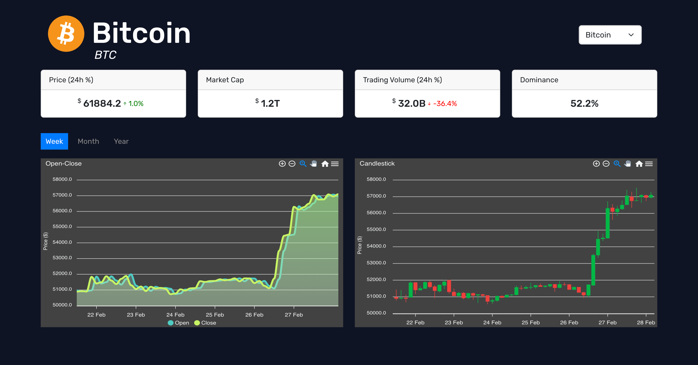
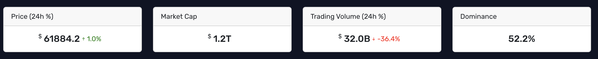
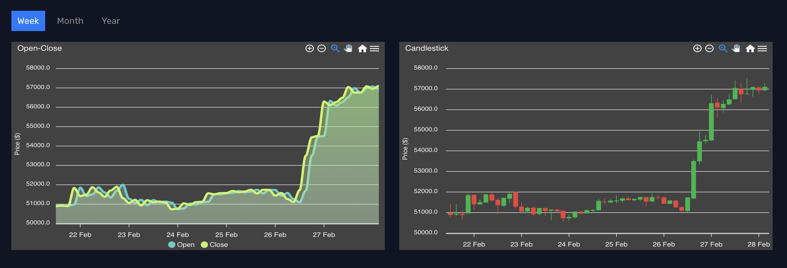

# Crypto Data Explorer

This project involves the analysis of cryptocurrency data sourced from the CoinMarketCap API and historical data parsed from .csv files. The objective is to create visualizations using Apex Charts to present key metrics and trends in the crypto market. The project encompasses the development of data cards, interactive charts, and timeframe filters.

## Configuration

### Server Start

1. Open a terminal
2. Navigate to the server directory: 'cd /server'
3. Install dependencies: 'npm install'
4. Start the server: 'npm start'

### Client Start

1. After starting the server, open a separate terminal.
2. Make sure you are at the main directory. ('cd ..' can be used to navigate up one directory)
3. Install dependencies: 'npm install'
4. Start the client: 'npm run dev'
5. Open your web browser and navigate to the designated localhost URL to view the application.

## Features

### Information Cards

Cards show the following information about the selected cryptocurrency:

- Price: Current market price.
- Market Cap: Total market capitalization.
- Trading Volume: Total trading volume.
- Market Dominance: Percentage share.

### Charts

Charts show the following information about the selected cryptocurrency over a specified time period(week, month, or year).

#### Line Chart

Displays the opening and closing prices.

#### Candlestick Chart

Shows the opening, closing, highest, and lowest values.

## Data Sources

The application utilizes data from CoinMarketCap, a trusted source for cryptocurrency market data, ensuring that users have access to accurate and up-to-date information 2. Additionally, for the charts, data is parsed from .csv files taken from CoinMarketCap, processed on the server side to ensure efficient data handling and rendering.

## License

This project is licensed under the MIT License - see the [LICENSE](LICENSE) file for details.
